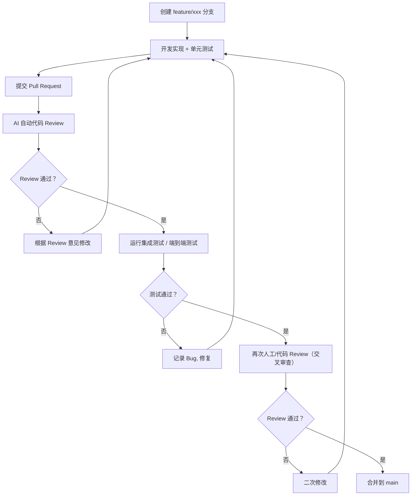
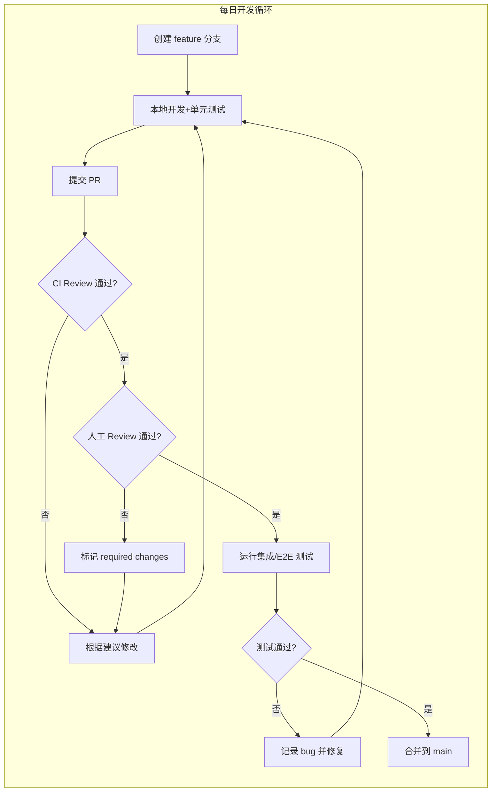

# AI Agent 技能安装工具 - 技术开发设计

## 一、背景与设计目标

随着 AI Agent 生态的快速发展，越来越多的工具（Claude Code、Cursor、Codex、Gemini CLI 等）支持通过 `SKILL.md` 格式的技能包来扩展 Agent 能力。然而，多 Agent 并存时手动复制技能的低效问题日益突出：一个技能往往需要在多个 Agent 目录间重复复制，更新后难以同步，维护工作与日俱增。

本设计旨在构建一个类似 Maven/npm 的技能安装工具，核心设计目标如下：

- **本地技能库为核心**：以本地仓库作为单一可信源，技能安装时从本地仓库复制或软链接到目标 Agent 目录
- **多源技能获取**：支持本地文件/文件夹/zip、HTTP 技能仓库页面、GitHub 单技能库及多技能统一库
- **CLI + GUI 双交互**：提供命令行工具满足自动化场景，同时提供可视化界面降低使用门槛
- **多 Agent 批量安装**：支持一次安装将同一技能同步到多个 Agent，并提供交互式多选安装体验
- **技能生命周期管理**：支持技能的添加、删除、更新、启用/禁用、导出等完整管理能力


## 二、整体架构设计

### 2.1 分层架构图

```
┌─────────────────────────────────────────────────────────────────┐
│                        交互层                                    │
│  ┌──────────────┐  ┌──────────────┐  ┌──────────────┐           │
│  │  CLI 命令    │  │ Tauri 桌面端 │  │  MCP Server  │           │
│  │  (oms/osm)   │  │ (Web UI)     │  │  (Agent访问)  │           │
│  └──────────────┘  └──────────────┘  └──────────────┘           │
├─────────────────────────────────────────────────────────────────┤
│                        核心服务层                                │
│  ┌──────────────┐  ┌──────────────┐  ┌──────────────┐           │
│  │ 技能发现模块 │  │ 技能安装模块 │  │ 同步管理模块 │           │
│  │(GitHub/本地/ │  │(复制/软链接) │  │(多Agent投影)  │           │
│  │ HTTP仓库)    │  │              │  │              │           │
│  └──────────────┘  └──────────────┘  └──────────────┘           │
│  ┌──────────────┐  ┌──────────────┐  ┌──────────────┐           │
│  │ 索引管理模块 │  │ 锁文件模块   │  │ 验证模块     │           │
│  │(技能索引缓存)│  │(版本追踪)    │  │(格式校验)    │           │
│  └──────────────┘  └──────────────┘  └──────────────┘           │
├─────────────────────────────────────────────────────────────────┤
│                        存储层                                    │
│  ┌─────────────────────────────────────────────────────────┐    │
│  │                    本地技能库 (~/.skill-repo/)           │    │
│  │  ┌─────────────┐  ┌─────────────┐  ┌─────────────┐      │    │
│  │  │ skill-a/    │  │ skill-b/    │  │ skill-c/    │ ...  │    │
│  │  │ SKILL.md    │  │ SKILL.md    │  │ SKILL.md    │      │    │
│  │  │ scripts/    │  │ references/ │  │ assets/     │      │    │
│  │  └─────────────┘  └─────────────┘  └─────────────┘      │    │
│  └─────────────────────────────────────────────────────────┘    │
│  ┌─────────────────────────────────────────────────────────┐    │
│  │              元数据存储 (~/.skill-repo/.meta/)           │    │
│  │  - index.json (技能索引)  - lock.json (安装记录)         │    │
│  │  - config.json (配置文件)  - repositories.json (仓库列表)│    │
│  └─────────────────────────────────────────────────────────┘    │
├─────────────────────────────────────────────────────────────────┤
│                        外部源                                    │
│  ┌──────────────┐  ┌──────────────┐  ┌──────────────┐           │
│  │ GitHub仓库   │  │ HTTP Registry│  │ 本地文件/ZIP │           │
│  │(单技能/多技能)│  │(skills.sh等) │  │              │           │
│  └──────────────┘  └──────────────┘  └──────────────┘           │
└─────────────────────────────────────────────────────────────────┘
```

### 2.2 核心数据流

技能安装的核心流程为：**技能获取 → 本地仓库缓存 → 目标 Agent 安装**。当用户执行安装命令时，系统先尝试从本地技能库获取技能；若本地不存在，则根据指定的源类型（GitHub/HTTP/本地文件）下载/导入技能到本地仓库；最终将技能从本地仓库安装（复制或软链接）到用户指定的 Agent 目录。

```
┌────────┐    ①安装请求    ┌────────┐    ②本地索引查询   ┌────────┐
│  User  │───────────────→│   CLI  │──────────────────→│ 本地   │
│        │                 │ 工具   │←──────────────────│ 技能库 │
└────────┘                 └────────┘    ⑦返回缓存      └────────┘
                               │                              ↑
                               │ ③本地不存在                  │ ⑥写入缓存
                               ↓                              │
                          ┌────────┐    ④技能获取      ┌────────┐
                          │ 发现   │──────────────────→│ GitHub│
                          │ 模块   │←──────────────────│ HTTP  │
                          └────────┘    ⑤返回技能      │ 本地  │
                                                        └────────┘
                               │
                               │ ⑧选择安装目标（多Agent）
                               ↓
                          ┌────────┐    ⑨安装          ┌────────┐
                          │ 安装   │──────────────────→│Agent A │
                          │ 模块   │──────────────────→│Agent B │
                          └────────┘                  └────────┘
```


## 三、本地技能库设计（类 Maven 管理）

### 3.1 目录结构设计

本地技能库采用类似 Maven 本地仓库的目录结构：

```bash
~/.skill-repo/                      # 本地技能库根目录
├── index.json                      # 技能全局索引
├── config.json                     # 用户配置
├── repositories.json               # 配置的外部技能仓库列表
├── lock.json                       # 安装锁定记录
├── skills/                         # 技能存储目录
│   ├── {namespace}/                # 命名空间（如 github 用户名）
│   │   ├── {skill-name}@latest/    # 最新版本
│   │   │   ├── SKILL.md
│   │   │   ├── scripts/
│   │   │   └── references/
│   │   └── {skill-name}@{version}/ # 指定版本
│   │       └── ...
│   └── local/                      # 本地导入技能（无命名空间）
│       └── {skill-name}/
│           └── ...
├── cache/                          # 下载缓存
│   └── {url-hash}/
│       └── (临时克隆/下载文件)
└── workspaces/                     # 可编辑工作区
    └── {skill-name}/
        └── (用于开发的working copy)
```

### 3.2 技能标识规范

参考现有生态的标准实践，技能应包含 `SKILL.md` 文件，采用 YAML frontmatter + Markdown 格式：

```yaml
---
name: pdf-processing
description: Extract and summarize PDF documents
version: 1.0.0
author: user/team
license: MIT
tags:
  - document
  - pdf
dependencies: []      # 预留依赖声明字段
---
# PDF Processing Skill
## Instructions
When the user asks about a PDF, do the following:
1. Read the file with the appropriate tool
2. Analyze the content
...
```

### 3.3 索引管理

`index.json` 维护本地所有技能的元数据：

```json
{
  "version": 1,
  "last_update": "2026-06-11T10:00:00Z",
  "skills": {
    "github:anthropic/skills/pdf": {
      "name": "pdf",
      "namespace": "github:anthropic/skills",
      "versions": ["1.0.0", "1.1.0"],
      "latest": "1.1.0",
      "source": "https://github.com/anthropic/skills/tree/main/pdf",
      "source_type": "github",
      "installed_size": "128KB",
      "tags": ["document", "pdf"]
    },
    "local:my-custom-skill": {
      "name": "my-custom-skill",
      "namespace": "local",
      "versions": ["latest"],
      "latest": "latest",
      "source": "/path/to/imported/skill",
      "source_type": "local"
    }
  }
}
```


## 四、软链接与复制模式的深入分析

### 4.1 两种安装模式对比

| 维度 | 软链接（Symlink） | 复制（Copy） |
|------|------------------|-------------|
| 存储开销 | 无额外开销 | 每个 Agent 一份副本 |
| 更新同步 | 修改一次，所有 Agent 自动同步 | 需手动同步或重新安装 |
| 跨平台兼容性 | Windows 需管理员权限或开发者模式 | 完全兼容 |
| 临时文件污染风险 | **存在风险** | 隔离，不影响共享源 |
| 回滚/卸载能力 | 删除链接即可，不影响源 | 需删除实际文件 |
| 技能版本切换 | 需重新链接 | 需重新复制 |

### 4.2 软链接风险详细分析

**风险一：技能在执行时会产生临时文件，污染本地技能库**

技能在执行过程中可能会生成临时数据（如日志、中间文件、缓存等）。若技能目录采用软链接，这些临时文件可能会被直接写入本地技能库的源目录中，导致：
- 技能库源文件被污染，影响其他项目对该技能的使用
- 难以区分用户数据和技能源数据
- 卸载/更新技能时可能残留临时文件

**风险二：多个 Agent 并发写入造成数据混乱**

若多个 Agent 同时使用同一个软链接技能并试图写入文件，可能引发文件锁冲突或数据覆盖。

**风险三：Windows 平台兼容性**

Windows 系统上创建软链接需要管理员权限或开启开发者模式，在普通用户场景下可能不可用。

### 4.3 现有生态的解决方案

当前生态中的主流方案各有侧重：

**逐项软链接（agentlink 方案）**：不再对整个技能目录做链接，而是为每个一级条目单独创建 symlink（或按文件粒度）。这样受管的技能与用户手写的技能可以并存于同一目录，临时实验不会被波及，卸载时也只移除自己创建的链接。

**自动降级复制（agent-skills-rs 方案）**：优先尝试软链接模式，失败时自动回退到复制模式，确保安装成功。

**Windows 自动降级（agent-skills-hub 方案）**：在 Windows 系统上自动将软链接降级为目录复制，避免权限问题。

### 4.4 推荐方案：隔离运行 + 混合模式

**核心原则**：将“技能存储库”与“技能运行区”分离。

**安装时**：
- 默认采用**软链接模式**，实现即时同步（修改技能后所有 Agent 同时生效）
- 支持 `--copy` 参数强制使用复制模式（用于共享技能库场景）
- 在 Windows 或无权限环境自动降级为复制模式

**运行时**（进阶设计）：
- 在技能执行时，为每个调用实例创建独立的临时运行目录
- 将技能文件从源目录**复制**到临时目录执行
- 执行完毕后根据配置决定是否保留临时文件
- 此方案借鉴容器化思想，确保本地技能库的纯净性

**软链接使用的最佳实践**：
- 软链接仅适用于**只读技能**场景
- 需要写入临时数据的技能，推荐使用复制模式或在技能内声明输出目录到 `$TMPDIR`
- 使用 `ln -sfn`（force, no-dereference）而非普通 `ln -s`，确保链接正确覆盖
- 定期执行 `skill doctor` 命令检查悬挂链接和受损技能


## 五、技能搜索/获取模块设计

### 5.1 多源搜索流程

```
技能安装请求
     │
     ▼
┌─────────────┐
│ 1. 解析源标识 │ 支持格式: owner/repo, owner/repo/skill,
│             │ owner/repo@version, http://..., file://..., local:...
└─────────────┘
     │
     ▼
┌─────────────┐
│ 2. 本地索引查询 │ 查 index.json，命中则进入安装阶段
└─────────────┘
     │ (不存在)
     ▼
┌─────────────────────────────────────────────┐
│ 3. 根据源类型分发                             │
├──────────────┬──────────────┬──────────────┤
│ GitHub源     │ HTTP源       │ 本地源       │
├──────────────┼──────────────┼──────────────┤
│ shallow-     │ 下载index.json│ 直接扫描     │
│ clone仓库    │ 解析skills    │ 验证SKILL.md │
│ 扫描SKILL.md │ 列表         │              │
└──────────────┴──────────────┴──────────────┘
     │
     ▼
┌─────────────┐
│ 4. 技能发现与多选 │ 若仓库包含多个技能，交互式多选提示
└─────────────┘
     │
     ▼
┌─────────────┐
│ 5. 写入本地技能库 │ 复制到 ~/.skill-repo/skills/
└─────────────┘
     │
     ▼
┌─────────────┐
│ 6. 更新索引    │ 更新 index.json
└─────────────┘
```

### 5.2 各源类型详细支持

**5.2.1 GitHub 源（单技能库）**

- 支持简写格式：`skill install anthropic/skills/pdf`
- 支持完整 URL：`https://github.com/anthropic/skills/tree/main/pdf`
- 支持分支/标签：`skill install anthropic/skills/pdf@main`
- 使用 `git clone --depth 1` 浅克隆优化速度

**5.2.2 GitHub 源（多技能统一库）**

多技能库是指一个 GitHub 仓库中包含多个独立技能目录的场景。典型目录结构：

```
skills-repo/
├── skill-a/
│   └── SKILL.md
├── skill-b/
│   └── SKILL.md
└── skill-c/
    └── SKILL.md
```

处理逻辑：
- 浅克隆仓库到临时目录
- 递归扫描 `SKILL.md` 文件位置（根目录、`skills/`、`.agents/skills/` 等常见位置）
- 通过 `@clack/prompts` 等库提供交互式多选提示
- 用户可勾选需要安装的一个或多个技能

**5.2.3 HTTP 技能仓库源**

- 支持 `skills.sh` 等社区 Registry
- 下载远程 `index.json` 获取技能列表
- 从 raw URL 下载具体 `SKILL.md`
- 支持自定义 Registry 地址配置

**5.2.4 本地源（文件/文件夹/ZIP）**

- 直接指定本地文件夹路径：`skill install ./my-skill`
- 支持 `.zip` 包格式：`skill install file:./skills-package.zip`
- 自动解压到临时目录后验证 `SKILL.md`


## 六、CLI 命令设计

### 6.1 命令体系

参考 `skillhub`、`open-skill-manager`、`agent-skills-hub` 等现有工具的实践经验，设计以下命令体系：

```bash
# 技能搜索与信息
skill search <query>                    # 搜索技能
skill list [--category <cat>]           # 列出所有技能
skill info <skill>                      # 查看技能详情
skill show <skill>                      # 显示技能内容

# 技能安装
skill install <source> [skill-name]     # 安装技能（交互式）
skill install <source> --agents <list>  # 指定安装到哪些 Agent
skill install <source> --global         # 全局安装

# 技能同步与管理
skill sync [--agents]                   # 同步已安装技能到 Agent
skill uninstall <skill> [--agents]      # 卸载技能
skill update [skill...]                 # 更新技能
skill enable/disable <skill> [--agent]  # 启用/禁用技能

# 配置管理
skill config [get/set] <key> [value]    # 配置管理
skill repo add/remove/list <source>     # 管理自定义技能仓库

# 工具类
skill init                              # 初始化本地技能库
skill validate <skill>                  # 验证技能格式
skill doctor                            # 诊断环境问题
skill export [--format yaml]            # 导出技能列表（类似 pip freeze）
skill import <file>                     # 批量导入技能
```

### 6.2 典型使用示例

**示例 1：从 GitHub 多技能库交互式安装并同步到多个 Agent**
```bash
$ skill install anthropic/skills
🔍 Cloning repository...
📂 Found 12 skills in the repository:
   [✓] pdf-processing
   [ ] code-review
   [ ] test-generation
   [ ] documentation
   ...
   [?] Select skills to install (space to select, enter to confirm)
> Select all

🎯 Select target agents:
   [✓] claude (Claude Code)
   [✓] cursor (Cursor)
   [ ] codex (OpenAI Codex)
   [ ] gemini (Gemini CLI)
> Select all

✅ Installing pdf-processing to claude... done
✅ Installing code-review to claude... done
...
✅ Syncing to 4 agents completed!
```

**示例 2：从本地 ZIP 安装技能**
```bash
$ skill install file:./my-skill-pack.zip --agents claude,cursor
```

**示例 3：从 skills.sh 社区搜索并安装**
```bash
$ skill search "react" --registry skills.sh
Found 5 skills:
  1. react-app-setup - Setup React app with best practices
  2. react-component-gen - Generate React components
  ...
$ skill install react-app-setup
```

### 6.3 配置文件设计

配置文件 `~/.skill-repo/config.json`：

```json
{
  "store_path": "~/.skill-repo/skills",
  "install_mode": "symlink",
  "auto_fallback_copy": true,
  "fallback_on_windows": true,
  "link_targets": [
    {
      "name": "claude",
      "path": "~/.claude/skills",
      "enabled": true
    },
    {
      "name": "cursor", 
      "path": "~/.cursor/skills",
      "enabled": true
    },
    {
      "name": "codex",
      "path": "~/.codex/skills",
      "enabled": false
    }
  ],
  "repositories": [
    {
      "name": "skills-sh",
      "url": "https://skills.sh",
      "type": "registry",
      "enabled": true
    },
    {
      "name": "my-team",
      "url": "https://github.com/myorg/team-skills",
      "type": "github",
      "enabled": true
    }
  ],
  "cache_ttl": 3600,
  "verbose": false,
  "default_agents": ["claude", "cursor"]
}
```


## 七、多 Agent 批量安装机制

### 7.1 安装模式

支持两种安装作用域：

**项目级安装**：技能安装到当前项目的 `.agents/skills/` 或各 Agent 对应的项目级目录（如 `.claude/skills/`、`.cursor/skills/`）。适用于项目特定的技能，随项目版本控制。

**全局安装**：技能安装到用户级目录（如 `~/.claude/skills/`、`~/.cursor/skills/`）。适用于跨项目通用的技能，对所有项目生效。

### 7.2 同步机制

核心设计思想是将“源技能”与“目标 Agent 安装”解耦：

1. **源技能管理**：所有技能实体文件统一存放在 `~/.skill-repo/skills/`
2. **配置注册**：在 `config.json` 中定义 `link_targets` 列表，声明需要同步的 Agent 目录
3. **执行同步**：`skill sync` 命令遍历所有已安装技能，在配置的每个 Agent 目录中创建指向源技能的链接（或复制）
4. **增量同步**：仅处理新增或变更的技能，避免全量扫描

```bash
# 修改配置添加新的 Agent 支持
$ skill config set link_targets '["~/.claude", "~/.cursor", "~/.gemini"]'

# 执行同步，将已安装技能链接到新 Agent
$ skill sync
🔄 Syncing 12 skills to 3 agents...
  claude: 12/12 skills linked
  cursor: 12/12 skills linked
  gemini: 10/12 skills linked (2 skills missing agent compatibility)
✅ Sync completed
```

这种设计借鉴了 `open-skill-manager` 的“统一存储 + 动态软链分发”思路，解决了多终端、多环境下的技能同步与管理问题。

### 7.3 支持的 Agent 目录映射

参考 `agent-skills-hub` 和 `openskill-cli` 的标准，定义 Agent 目录映射表：

| Agent | 项目级路径 | 全局路径 |
|-------|-----------|---------|
| Claude Code | `.claude/skills/` | `~/.claude/skills/` |
| Cursor | `.cursor/skills/` | `~/.cursor/skills/` |
| OpenAI Codex | `.codex/skills/` | `~/.codex/skills/` |
| Gemini CLI | `.gemini/skills/` | `~/.gemini/skills/` |
| Antigravity | `.antigravity/skills/` | `~/.antigravity/skills/` |
| Windsurf | `.windsurf/skills/` | `~/.codeium/windsurf/skills/` |
| OpenCode | `.opencode/skill/` | `~/.config/opencode/skill/` |
| GitHub Copilot | `.github/skills/` | `~/.copilot/skills/` |
| Trae | `.trae/skills/` | `~/.trae/skills/` |
| Qwen Code | `.qwen/skills/` | `~/.qwen/skills/` |

### 7.4 交互式安装流程

参考 `openskill-cli` 的多选交互设计：

```
$ skill install anthropic/skills

? Select skills to install (space to select, enter to continue)
  ◯ pdf-processing
  ◯ code-review
  ◯ test-generation
  ◯ documentation
  ◯ data-analysis
❯ ◉ select all (4 skills selected)

? Select target agents (space to select, enter to install)
  ◉ claude (Claude Code)       ← 已选
  ◉ cursor (Cursor)             ← 已选
  ◯ codex (OpenAI Codex)        ← 未选
  ◉ gemini (Gemini CLI)         ← 已选
  ◯ antigravity (Antigravity)   ← 未选

  Help: ↑↓ navigate, space select, enter confirm

Installing 4 skills to 3 agents...
✓ pdf-processing → claude, cursor, gemini
✓ code-review → claude, cursor, gemini
✓ test-generation → claude, cursor, gemini
✓ documentation → claude, cursor, gemini

✅ Installation complete!
```


## 八、可视化操作界面设计

### 8.1 界面定位

- **定位**：CLI 的视觉化增强，非替代方案
- **适用场景**：技能浏览、状态查看、批量管理、新手引导
- **底层核心**：Web UI 调用 CLI 命令实现所有操作

### 8.2 技术选型

采用 **Tauri + Vue/React** 方案（本地优先，打包体积小，性能优异）：

- **后端核心**：Rust + Tauri，调用 CLI 命令执行实际操作
- **前端框架**：Vue 3 / React 18 + TypeScript
- **UI 组件**：Naive UI / Ant Design
- **架构优势**：
  - 本地优先，数据完全存储在用户本地
  - Tauri 打包体积小（约 10-20MB），远小于 Electron
  - 前端可直接调用 Rust 后端函数，性能高效
  - 跨平台支持（Windows、macOS、Linux）

### 8.3 主要界面模块

1. **技能总览（Dashboard）**
   - 卡片视图/列表视图切换，统一展示本机所有技能
   - 支持按 Agent、状态（启用/禁用）、来源筛选
   - 顶部指标卡展示技能总数、已安装 Agent 数、可用更新数

2. **技能市场**
   - 支持从 SkillHub、GitHub、自定义仓库发现技能
   - 按分类、热门、最新排序
   - 展示技能详情（作者、版本、下载量、描述）

3. **项目管理**
   - 扫描并列出包含 skill 目录的项目
   - 支持手动添加项目路径
   - 按项目维度管理技能

4. **技能安装与同步**
   - 多 Agent 多选安装界面
   - 批量启用/禁用/删除操作
   - 技能更新提醒和一键更新

5. **技能详情与编辑**
   - 展示技能元数据和文件列表
   - 内置 Markdown 编辑器，支持实时预览
   - 支持 `.md`、`.json`、`.yaml`、`.py`、`.sh` 等常见格式编辑


## 九、开发实施计划

## 完整研发流程计划：AI Agent 技能安装工具

本计划面向一个完整的软件开发项目，涵盖从需求分析到交付上线的所有阶段，并明确每个开发阶段的**智能体（AI Agent）协作规范**：所有功能模块必须遵循 **分支开发 → 代码 Review → 测试 → 问题修复（循环）→ 合并主干** 的闭环流程。

---

### 1、整体研发阶段划分

| 阶段 | 名称 | 主要产出 | 预计工期 |
|------|------|----------|----------|
| 1 | 需求分析与架构设计 | 需求文档、系统架构图、接口定义 | 3 天 |
| 2 | 基础框架搭建 | 项目脚手架、本地技能库核心、配置管理 | 5 天 |
| 3 | 技能发现与获取模块 | 多源技能获取（GitHub/HTTP/本地） | 7 天 |
| 4 | 技能安装与同步模块 | 软链接/复制安装、多 Agent 同步 | 6 天 |
| 5 | 元数据编辑与展示模块 | 技能信息查看、交互式编辑 | 4 天 |
| 6 | CLI 命令体系 | 完整命令行工具 | 5 天 |
| 7 | GUI 桌面应用 | Tauri 可视化界面 | 10 天 |
| 8 | 集成测试与文档 | 端到端测试、用户手册、API 文档 | 5 天 |
| 9 | 发布与迭代 | 打包发布、反馈收集 | 2 天 |

总计约 **47 人天**（约 2 个月，按 1 人全职估算，可并行开发）

---

### 2、通用开发流程规范（所有阶段强制执行）

每个功能模块的开发必须严格遵循以下步骤，**任何跳过或不合规的操作将不被允许合并**：

#### 2.1 分支策略

- **主分支**：`main`（始终保持稳定、可发布状态）
- **开发分支**：从 `main` 切出，命名规则 `feature/{模块名}` 或 `fix/{问题简述}`
- **禁止直接在 `main` 上提交代码**

#### 2.2 每个功能点的完整闭环流程



#### 2.3 测试要求

- **单元测试**：核心逻辑覆盖率 ≥ 80%
- **集成测试**：涉及外部调用（GitHub API、文件系统）必须模拟
- **端到端测试**：CLI 命令和 GUI 核心流程手动验证
- **回归测试**：每次合并前运行全量测试套件

#### 2.4 代码 Review 标准

- **自动 Review**：使用 ESLint / Prettier / Clippy 等工具 + AI 代码审查（如 CodeRabbit、GitLab Copilot）
- **人工 Review**：至少一名非作者开发者审查，重点关注逻辑正确性、边界条件、错误处理
- **必须满足**：无高危漏洞、无明显的性能问题、符合编码规范

---

### 3、各阶段详细任务拆解（含智能体指令）

以下每个任务都假定由 **AI 智能体（或人类开发者按照相同流程）执行**。每个任务开始前，智能体必须创建独立分支，完成后提交 PR，并触发 Review+测试循环。

#### 阶段 1：需求分析与架构设计

| 任务 ID | 任务描述 | 智能体要求 | 产出 |
|---------|----------|------------|------|
| 1.1 | 编写详细需求文档，包括用户故事、非功能需求（性能、安全性） | 分支 `feature/requirements`；PR 需包含需求 checklist 验证 | `docs/requirements.md` |
| 1.2 | 设计系统架构图、组件接口、数据流 | 分支 `feature/architecture`；需附带接口定义（OpenAPI 或 protobuf） | `docs/architecture.md`, `docs/api.md` |
| 1.3 | 定义技能包规范（SKILL.md 格式）和本地技能库目录结构 | 分支 `feature/skill-spec`；输出 JSON Schema | `docs/skill-schema.json` |

**Review 要点**：架构是否满足可扩展性？接口是否清晰？安全风险是否考虑？

#### 阶段 2：基础框架搭建

| 任务 ID | 任务描述 | 智能体要求 | 产出 |
|---------|----------|------------|------|
| 2.1 | 初始化项目结构（CLI + GUI 分离，共享核心库） | 分支 `feature/project-init`；配置 TS/Rust 编译、单元测试框架 | `package.json`, `Cargo.toml`, `tsconfig.json` |
| 2.2 | 实现本地技能库初始化（`skill init` 命令），创建 `~/.skill-repo/` 目录结构 | 分支 `feature/skill-init`；包含单元测试 | `src/init.ts` |
| 2.3 | 实现配置管理（`skill config`），支持读写 `config.json` | 分支 `feature/config`；测试覆盖 get/set 操作 | `src/config.ts` |
| 2.4 | 实现日志模块和错误处理基类 | 分支 `feature/logging`；统一输出格式 | `src/logger.ts` |

**Review+测试**：确保目录权限正确、跨平台兼容（Windows/macOS/Linux）。测试失败则打回修改。

#### 阶段 3：技能发现与获取模块

| 任务 ID | 任务描述 | 智能体要求 | 产出 |
|---------|----------|------------|------|
| 3.1 | 实现从 GitHub 单技能库获取（浅克隆指定路径） | 分支 `feature/github-single`；需 mock GitHub API 测试 | `src/sources/github.ts` |
| 3.2 | 实现从 GitHub 多技能库获取（扫描 `SKILL.md` 位置，交互式多选） | 分支 `feature/github-multi`；需测试扫描逻辑 | `src/sources/github-multi.ts` |
| 3.3 | 实现从 HTTP Registry（如 skills.sh）获取技能列表和下载 | 分支 `feature/http-registry`；支持自定义 registry URL | `src/sources/http.ts` |
| 3.4 | 实现从本地文件/文件夹/ZIP 导入技能 | 分支 `feature/local-import`；支持递归解压和验证 | `src/sources/local.ts` |
| 3.5 | 实现技能索引管理（`index.json` 的读写与更新） | 分支 `feature/skill-index`；测试并发安全 | `src/index.ts` |

**Review+测试**：每种源类型都要有端到端测试（真实网络或模拟）。发现 bug 则循环修复，直到所有测试通过。

#### 阶段 4：技能安装与同步模块

| 任务 ID | 任务描述 | 智能体要求 | 产出 |
|---------|----------|------------|------|
| 4.1 | 实现软链接安装（支持 Linux/macOS，Windows 自动降级） | 分支 `feature/symlink-install`；测试链接创建和悬挂检测 | `src/installer/symlink.ts` |
| 4.2 | 实现复制模式安装（`--copy` 参数） | 分支 `feature/copy-install`；测试复制后文件独立性 | `src/installer/copy.ts` |
| 4.3 | 实现多 Agent 目标定义（`link_targets` 配置） | 分支 `feature/agent-targets`；支持项目级和全局级 | `src/targets.ts` |
| 4.4 | 实现 `skill sync` 命令：将本地技能库中已安装的技能同步到所有配置的 Agent 目录 | 分支 `feature/sync`；测试增量同步 | `src/commands/sync.ts` |
| 4.5 | 实现 `skill uninstall` 和 `skill update` | 分支 `feature/manage`；测试卸载时清理链接 | `src/commands/uninstall.ts` |

**Review+测试**：重点测试跨平台软链接行为、多 Agent 并发写入的模拟。Bug 修复后再次 Review。

#### 阶段 5：元数据编辑与展示模块

| 任务 ID | 任务描述 | 智能体要求 | 产出 |
|---------|----------|------------|------|
| 5.1 | 实现 `skill info` 命令，解析 `SKILL.md` 中的 frontmatter 并美化输出 | 分支 `feature/skill-info`；测试缺失 frontmatter 时的降级 | `src/commands/info.ts` |
| 5.2 | 实现 `skill edit` 交互式编辑（使用 `@clack/prompts`） | 分支 `feature/skill-edit`；测试修改后回写正确性 | `src/commands/edit.ts` |
| 5.3 | 实现 `skill edit --description` 快速设置 | 分支 `feature/edit-description`；测试命令行参数 | `src/commands/edit-description.ts` |
| 5.4 | 实现调用系统编辑器（`$EDITOR`）编辑完整 `SKILL.md` | 分支 `feature/system-editor`；测试环境变量回退 | `src/commands/edit-editor.ts` |

**Review+测试**：YAML 解析和序列化的边界情况（特殊字符、多行字符串）。循环直到无解析错误。

#### 阶段 6：CLI 命令体系整合

| 任务 ID | 任务描述 | 智能体要求 | 产出 |
|---------|----------|------------|------|
| 6.1 | 实现命令路由和帮助信息（Commander.js 或 Clap） | 分支 `feature/cli-router`；测试子命令识别 | `src/cli.ts` |
| 6.2 | 实现 `skill list`、`skill search` 等查询命令 | 分支 `feature/list-search`；测试过滤和排序 | `src/commands/list.ts` |
| 6.3 | 实现 `skill doctor` 诊断命令（检查软链接、权限、目录完整性） | 分支 `feature/doctor`；输出可读诊断报告 | `src/commands/doctor.ts` |
| 6.4 | 实现 `skill export` / `skill import` 用于技能列表迁移 | 分支 `feature/export-import`；测试 YAML/JSON 导入导出 | `src/commands/export.ts` |
| 6.5 | 完善所有命令的错误处理和用户提示 | 分支 `feature/error-handling`；统一退出码 | `src/errors.ts` |

**Review+测试**：端到端运行所有命令，模拟真实用户操作。任何命令崩溃即打回。

#### 阶段 7：GUI 桌面应用

| 任务 ID | 任务描述 | 智能体要求 | 产出 |
|---------|----------|------------|------|
| 7.1 | 初始化 Tauri 项目，配置前端（Vue 3 + Naive UI） | 分支 `feature/gui-init`；确保能调用 CLI 命令 | `src-tauri/`, `web/` |
| 7.2 | 实现技能总览页面（卡片/列表视图，展示本地所有技能） | 分支 `feature/gui-dashboard`；需从 CLI 获取数据 | `web/views/Dashboard.vue` |
| 7.3 | 实现技能市场页面（接入 GitHub/HTTP 源，支持搜索安装） | 分支 `feature/gui-market`；模拟外部 API 测试 | `web/views/Market.vue` |
| 7.4 | 实现技能详情与编辑页面（查看元数据、内嵌 Markdown 编辑器） | 分支 `feature/gui-detail`；支持实时预览 | `web/views/SkillDetail.vue` |
| 7.5 | 实现多 Agent 批量安装弹窗（多选技能+多选 Agent） | 分支 `feature/gui-install`；交互流畅 | `web/components/InstallDialog.vue` |
| 7.6 | 实现全局配置页面（管理 Agent 目录、registry 列表） | 分支 `feature/gui-config`；配置立即生效 | `web/views/Settings.vue` |

**Review+测试**：手动测试所有 GUI 交互，确保与 CLI 后端行为一致。每个 PR 必须附带 GUI 操作录屏。

#### 阶段 8：集成测试与文档

| 任务 ID | 任务描述 | 智能体要求 | 产出 |
|---------|----------|------------|------|
| 8.1 | 编写端到端测试脚本（模拟用户安装、同步、编辑全流程） | 分支 `feature/e2e-tests`；使用 Playwright（GUI）和 shell 脚本（CLI） | `tests/e2e/` |
| 8.2 | 编写用户手册（CLI 命令参考 + GUI 操作指南） | 分支 `feature/user-docs`；包含截图和示例 | `docs/user-manual.md` |
| 8.3 | 编写 API 文档（供二次开发或插件扩展） | 分支 `feature/api-docs`；使用 TypeDoc 生成 | `docs/api/` |
| 8.4 | 进行全平台兼容性测试（Windows/macOS/Linux） | 分支 `feature/compat-test`；记录问题并修复 | 测试报告 |

**Review+测试**：所有已知 bug 必须记录到 issue，并在修复后回归测试。合并前要求所有测试通过。

#### 阶段 9：发布与迭代

| 任务 ID | 任务描述 | 智能体要求 | 产出 |
|---------|----------|------------|------|
| 9.1 | 打包 CLI 二进制和 GUI 安装程序（.msi, .dmg, .deb） | 分支 `release/v1.0.0`；使用 GitHub Actions | 安装包 |
| 9.2 | 编写 CHANGELOG 和发布说明 | 分支 `release/changelog` | `CHANGELOG.md` |
| 9.3 | 发布到 GitHub Releases 和包管理器（npm, cargo） | 需人工确认，AI 辅助生成发布脚本 | 在线发布 |
| 9.4 | 收集用户反馈，建立 issue 模板和 feature request 流程 | 分支 `docs/community` | `CONTRIBUTING.md` |

---

### 4、智能体协作流程图（全局）

下图展示了各阶段任务如何通过分支、PR、Review、测试循环串联起来：



**关键约束**：
- 每个 PR 必须包含至少一个测试用例（单元测试或集成测试）。
- 合并后自动触发回归测试，若失败则回滚合并。
- 每周进行一次全量代码 Review 会议（针对本周合并的 PR）。

---

### 5、质量门禁（Quality Gates）

在合并到 `main` 之前，必须满足以下所有条件：

| 门禁项 | 阈值 | 自动化方式 |
|--------|------|------------|
| 单元测试通过率 | 100% | `npm test` / `cargo test` |
| 代码覆盖率 | ≥ 80% | `cargo-tarpaulin` / `jest --coverage` |
| Lint 检查 | 0 错误 | ESLint, Clippy |
| 安全漏洞扫描 | 0 高危 | `npm audit`, `cargo-audit` |
| 集成测试（模拟外部 API） | 全部通过 | 自定义 mock |
| 跨平台兼容 | Linux/macOS/Windows 核心命令可运行 | CI 矩阵测试 |

任何门禁失败，PR 状态置为“需要修复”，智能体必须重新进入开发循环。

---

### 6、总结

本计划详细列出了从需求到发布的每一阶段，并强制要求每个功能分支经历 **开发 → 自动 Review → 人工 Review → 测试 → 再 Review → 再测试** 的闭环，确保所有代码合并前无已知 bug。智能体（无论是人类开发者还是 AI 助手）都需严格遵守此流程，以保证产出高质量、可靠的技能安装工具。

### 9.2 建议技术选型

| 层级 | 方案 | 备选 |
|------|------|------|
| CLI 框架 | Commander.js (Node.js) / Clap (Rust) | oclif, cobra (Go) |
| 桌面端 | Tauri (Rust + 前端) | Electron, neutralino.js |
| 前端框架 | Vue 3 + Naive UI | React 18 + Ant Design |
| 包管理 | npm / pnpm | cargo / uv |
| Git 操作 | simple-git / git2-rs | 系统 git 调用 |
| 交互式 CLI | @clack/prompts / Inquirer.js | enquirer |
| 配置文件 | JSON5 / TOML | YAML |

## 十一、技能介绍录入与元数据编辑功能

技能描述（`description`）是 Agent 理解和使用技能的关键信息。本工具设计了一套完整的技能元数据查看与编辑机制，允许用户**优先读取 `SKILL.md` 中的元数据**，并支持灵活地**展示或修改**。

### 11.1 设计原则

- **唯一真源**：元数据直接写入 `SKILL.md` 文件的 YAML frontmatter，保持技能包的自描述性和跨工具兼容性
- **优先展示**：所有展示操作优先解析 `SKILL.md` 中的现有内容
- **交互可控**：用户可明确选择“仅查看”或“修改后保存”，避免误操作
- **格式健壮**：自动处理 frontmatter 缺失、格式错误等情况，并提供友好的错误提示

### 11.2 元数据格式约定

`SKILL.md` 文件采用标准 YAML frontmatter + Markdown 结构：

```yaml
---
name: pdf-processing
description: Extract and summarize PDF documents
version: 1.0.0
author: user/team
license: MIT
tags:
  - document
  - pdf
dependencies: []
---
# PDF Processing Skill
## Instructions
...
```

工具默认读取以下元数据字段：
- `name`（技能名称）
- `description`（技能介绍，必填）
- `version`（版本号）
- `author`（作者）
- `license`（许可证）
- `tags`（标签列表）
- `dependencies`（依赖声明）

### 11.3 CLI 实现方案

#### 11.3.1 查看技能元数据

```bash
skill info <skill>              # 显示技能完整元数据（包含介绍）
skill info <skill> --field description  # 仅显示介绍
skill show <skill>              # 等效命令
```

**交互示例**：

```bash
$ skill info pdf-processing

📄 Skill: pdf-processing
━━━━━━━━━━━━━━━━━━━━━━━━━━━━━━━━━━━━━━━━━━
  Name:        pdf-processing
  Description: Extract and summarize PDF documents
  Version:     1.0.0
  Author:      team/data
  License:     MIT
  Tags:        document, pdf
  Source:      github:anthropic/skills/pdf
  Installed:   ~/.skill-repo/skills/github:anthropic/skills/pdf@1.0.0

━━━━━━━━━━━━━━━━━━━━━━━━━━━━━━━━━━━━━━━━━━
Do you want to edit this skill's metadata? (y/N): _
```

#### 11.3.2 编辑技能元数据（介绍录入/修改）

方式一：**单字段快速编辑**（推荐用于 `description`）

```bash
skill edit <skill> --description    # 仅编辑介绍字段
skill edit <skill> --description "New description text"  # 直接设置
```

方式二：**完整元数据交互编辑**

```bash
skill edit <skill>                  # 进入多字段交互编辑
```

交互流程设计（使用 `@clack/prompts`）：

```
$ skill edit pdf-processing

🔧 Editing metadata for skill: pdf-processing
Press Enter to keep current value, type new value to change.

Current description: "Extract and summarize PDF documents"
New description: > Extract text and tables from PDFs, with OCR support

Current version: "1.0.0"
New version: > 1.1.0

Current author: "team/data"
New author: > data-platform

Current license: "MIT"
New license: > 

Current tags: document, pdf
New tags (comma separated): > document, pdf, ocr

✅ Metadata updated successfully!
   Updated SKILL.md at ~/.skill-repo/skills/github:anthropic/skills/pdf@1.1.0/SKILL.md
```

方式三：**调用系统编辑器**（适合批量修改）

```bash
skill edit <skill> --editor         # 打开 $EDITOR 编辑完整 SKILL.md
```

#### 11.3.3 选择“展示”还是“修改”的典型场景

用户执行 `skill info` 后，系统询问是否编辑，输入 `y` 即进入修改流程，输入 `n` 则退出。这实现了**先展示、再决定是否修改**的清晰逻辑。

若用户只想快速修改而不查看，可直接使用 `skill edit` 命令。

### 11.4 GUI 实现方案

在可视化界面中，技能详情页将提供两种模式：

**1. 查看模式（默认）**
- 以只读表单展示所有元数据字段
- 底部显示“编辑”按钮

**2. 编辑模式**（点击“编辑”后进入）
- 表单变为可编辑状态
- 每个字段下方显示当前值，用户可修改
- 提供“保存”和“取消”按钮
- 保存后立即更新 `SKILL.md` 并刷新界面

**界面示意图**：

```
┌─────────────────────────────────────────────┐
│  pdf-processing                         [编辑]│
├─────────────────────────────────────────────┤
│  介绍 (Description)                          │
│  ┌─────────────────────────────────────┐   │
│  │ Extract and summarize PDF documents │   │
│  └─────────────────────────────────────┘   │
│  版本 (Version)         1.0.0               │
│  作者 (Author)          team/data           │
│  许可证 (License)       MIT                 │
│  标签 (Tags)            document, pdf       │
├─────────────────────────────────────────────┤
│  [查看原始 SKILL.md]  [同步到 Agent]         │
└─────────────────────────────────────────────┘
```

### 11.5 元数据存储与同步策略

| 操作 | 存储位置 | 同步行为 |
|------|---------|---------|
| 查看 | 读取 `~/.skill-repo/skills/{skill}/SKILL.md` | 无 |
| 修改 | 直接写回同一 `SKILL.md` | 若该技能已通过软链接安装到 Agent，修改后所有 Agent 自动生效（软链接模式）；若为复制模式，需执行 `skill sync` 重新同步 |

**建议**：默认使用软链接模式安装技能，这样元数据的修改会即时反映到所有引用该技能的 Agent 中，无需额外同步操作。

### 11.6 命令总结

| 命令 | 作用 | 是否提供“展示/修改”选择 |
|------|------|----------------------|
| `skill info <skill>` | 展示完整元数据，询问是否编辑 | 是（交互式） |
| `skill info <skill> --field description` | 仅展示介绍 | 否（纯查看） |
| `skill edit <skill>` | 进入交互式多字段编辑 | 否（直接修改） |
| `skill edit <skill> --description "..."` | 直接设置介绍内容 | 否（直接修改） |
| `skill edit <skill> --editor` | 调用系统编辑器编辑 SKILL.md | 否（直接修改） |

通过以上设计，用户既能快速查看技能介绍，又能按需录入或修改元数据，且始终以 `SKILL.md` 为唯一真源，保持技能包的可移植性和生态兼容性。

## 十二、总结

本设计提出了一套完整的 AI Agent 技能安装工具方案，核心创新在于：

1. **本地技能库模式**：借鉴 Maven 的设计思想，以本地仓库为单一可信源，支持版本化管理和多技能共享
2. **混合安装策略**：软链接 + 复制的双模式设计，兼顾即时同步的便利性与数据隔离的安全性
3. **多源统一抽象**：将 GitHub、HTTP Registry、本地文件等来源统一抽象为技能发现接口，实现无缝扩展
4. **多 Agent 批量同步**：将技能源与 Agent 目标解耦，支持一次性安装到多个 Agent，彻底解决多 Agent 碎片化问题
5. **CLI + GUI 双交互**：CLI 保证自动化和脚本化需求，GUI 提供友好的可视化管理体验

当前 AI Agent 技能管理生态正如 2010 年代初期的 npm 或 pip，各工具还在探索各自的形态。此设计通过借鉴软件包管理器的成熟经验，并结合 AI Agent 技能的特殊需求（软链接安全性、多 Agent 分发等），有望为开发者提供一套易用、安全、可扩展的技能管理解决方案。